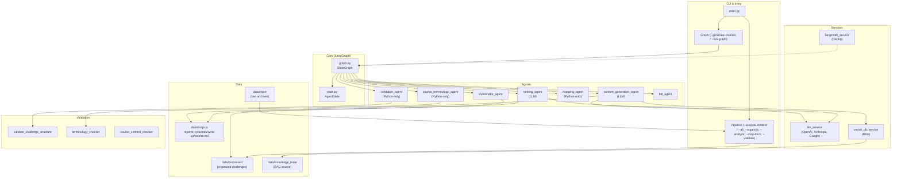
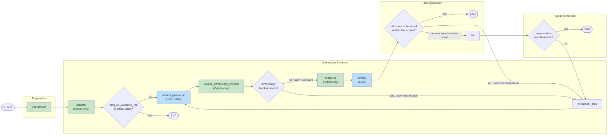
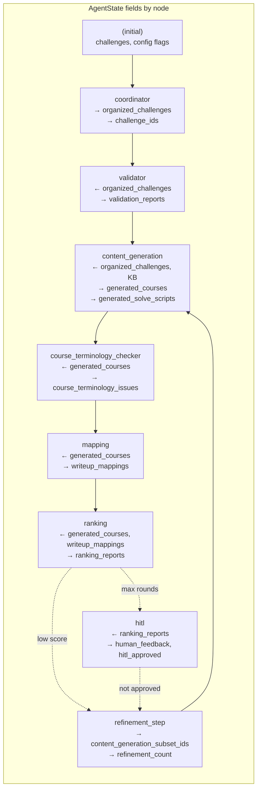
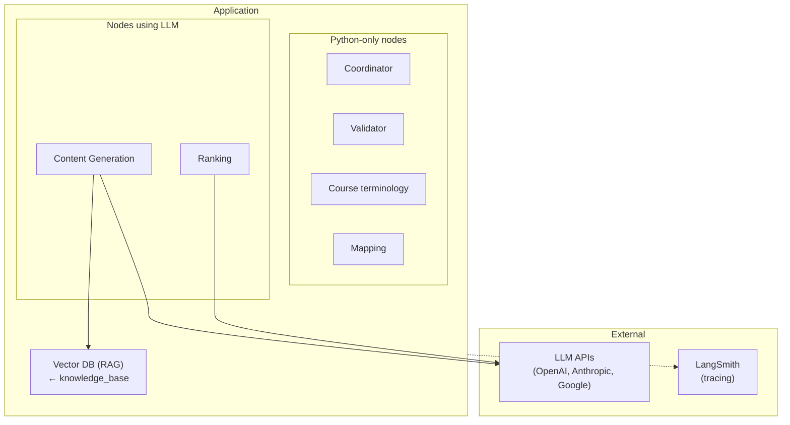

# System Architecture for Automated Cyber Range Content Validation

This document details the proposed modular architecture for the Master's Dissertation project: "Automated System based on Intelligent Agents for Cyber Range Content Validation." It leverages Python, intelligent agents orchestrated by LangChain/LangGraph, and various AI/ML technologies to achieve its goals of content validation, generation, and ranking.

## 1. Folder Structure

The project adopts a clear, modular folder structure to organize code, data, and configurations.

```
.
├── docs/
│   ├── reference/           # Architecture, conventions, and reference docs
│   │   ├── ARCHITECTURE.md
│   │   ├── brief.md
│   │   └── CONVENTIONS.md
│   ├── initial_project_information/   # cerinte.pdf, first_gem.md
│   └── pedagogical_expertise/         # Reference documents and domain knowledge
├── data/
│   ├── input/               # Raw challenge archives (.zip files uploaded by user)
│   ├── processed/           # Extracted and pre-processed challenge files (unzipped contents)
│   ├── knowledge_base/      # Curated documents for RAG (e.g., existing high-quality write-ups,
│   │                        # technical documentation, glossaries, challenge templates)
│   └── outputs/             # Validation reports (.json), ranking reports (.json). Generated courses
│                            # (course.md) live under PROCESSED_DIR/.../cyberedu/write-up/course.md
├── src/
│   ├── main.py              # Main entry point for the application (e.g., CLI)
│   ├── config/              # Configuration settings for LLMs, paths, thresholds, etc.
│   │   └── settings.py      # Pydantic-based configuration management
│   ├── agents/
│   │   ├── __init__.py
│   │   ├── coordinator_agent.py          # Orchestrates the overall workflow of other agents
│   │   ├── validation_agent.py           # Handles structural and initial content integrity checks
│   │   ├── content_generation_agent.py   # Generates courses (Cybersecurity Expert Educator persona)
│   │   ├── ranking_agent.py              # Evaluates content quality (Learning/Pedagogical & Technical Expert personas)
│   │   └── hitl_agent.py                 # Manages human intervention points (Human-in-the-Loop)
│   ├── core/
│   │   ├── __init__.py
│   │   ├── state.py                      # Defines the LangGraph state for the agent workflow
│   │   └── graph.py                      # Defines the LangGraph agent workflow
│   ├── services/                         # Integrations with external technologies
│   │   ├── __init__.py
│   │   ├── llm_service.py                # Wrapper for interacting with various LLM APIs
│   │   ├── vector_db_service.py          # Interface for the Vector Database (RAG)
│   │   ├── langsmith_service.py          # Setup for LangSmith tracing and monitoring
│   ├── models/                           # Pydantic models for strict data validation and structure
│   │   ├── __init__.py
│   │   ├── challenge_models.py           # Models for challenge metadata, files
│   │   ├── report_models.py              # Models for validation and ranking reports
│   └── utils/                            # General utility functions (e.g., file operations, logging)
│       └── __init__.py
├── tests/                                # Unit and integration tests
├── .env.example                          # Example environment variables file
├── requirements.txt                      # Project dependencies
└── README.md
```

## 2. System Architecture (Components and Services)



## 3. Pipeline Data Flow (LangGraph)

End-to-end flow of control and state between graph nodes.



## 4. State Flow (What Each Node Reads and Writes)



## 5. External and Internal Dependencies



**Summary:** LLM nodes: Content Generation, Ranking. Python-only: Validation, Course terminology checker, Mapping. See `FLOW_AND_LLM.md` for token-saving options.

## 6. High-Level Data Flow

The system has two phases: **(1) Pipeline** (organize → analyze → map-docs → validate) and **(2) Graph** (validation → content generation → terminology check → mapping → ranking → HITL/refinement).

### Pipeline (CLI: `--analyse-contest` or `--all`)

2.  **Analyze:** Structure, file types, and dependencies are analyzed. Output: logs and statistics.
3.  **Map-docs:** Official PDFs are linked to challenges via text matching. Output: challenge → documentation mapping.
4.  **Validate:** Structural and Step 0 reproducibility checks. Output: validation reports.

### Graph (CLI: `--generate-courses` or `--run-graph`)

1.  **Coordinator:** Loads organized challenges from `data/processed/` into state (`organized_challenges`, `challenge_ids`). RAG is ingested from `data/knowledge_base/` before the graph runs.
2.  **Validation:** Structural checks on each challenge; optionally routes to END if `stop_on_validation_fail` and critical issues.

3.  **Content Generation (LLM + RAG):** Queries the Vector Database for relevant context. Uses the LLM Service to generate pedagogical **courses** (output: `course.md` in `cyberedu/write-up/`). See `TERMINOLOGY.md` for course vs writeup.
4.  **Course Terminology Checker (Python-only):** Validates ATT&CK/CWE/OWASP IDs in generated courses.
5.  **Mapping (Python-only):** Extracts MITRE ATT&CK, CWE, OWASP IDs for writeup mapping.
6.  **Ranking (LLM):** Pedagogical and technical reviewers evaluate the generated course. If scores are below threshold, the graph routes to refinement or HITL.
7.  **HITL / Refinement:** Human review at ranking checkpoints; refinement loops back to content generation when not approved.
8.  **Final Output:** `course.md` per challenge in `cyberedu/write-up/`; `validation_report.json`, `ranking_report.json` in `data/outputs/`.

**Knowledge base and dictionary:** All glossary elements (NIST, ATT&CK, CyBOK, CWE, OWASP WSTG) live in `data/knowledge_base/`. Agents load term sets from these files for RAG and taxonomy tagging.

## 7. Technology Choices and Rationale

*   **Python:** The core programming language, chosen for its extensive AI/ML ecosystem, readability, and compatibility with LangChain/LangGraph.
*   **Pydantic:** Used for defining data models (`src/models/`). Ensures strict data validation, type checking, and structured data handling across agents and components, critical for maintaining consistency and reducing errors in complex data flows.
*   **LangChain / LangGraph:**
    *   **LangGraph:** Provides the state machine for orchestrating complex multi-agent interactions, managing conversation history, and enabling `Human-in-the-Loop` (HITL) checkpoints. This is foundational for the iterative and collaborative nature of the agents.
    *   **LangChain:** Provides foundational components for LLM interactions, tool integrations, and prompt management within the agents.
*   **LLM APIs (OpenAI, Google, Claude):** Chosen for their advanced generative capabilities, allowing for testing and comparison of different models across experimental configurations. The `LLM Service` abstracts these for flexible integration.
*   **Vector Database (e.g., ChromaDB / FAISS / Custom):** Essential for implementing the **Retrieval Augmented Generation (RAG)** system. Stores vectorized embeddings of the project's knowledge base, enabling efficient semantic search and grounding LLM outputs in specific, relevant documents. Initial development might use an in-memory solution, with future consideration for more persistent or scalable options.
*   **Ragas / DeepEval:** Critical for evaluating the performance of the RAG system and the overall quality of LLM-generated content. These frameworks provide metrics to assess aspects like faithfulness, context relevance, and answer correctness, directly supporting the ranking system and academic validation.
*   **LangSmith:** Indispensable for observability, debugging, and monitoring of complex agent workflows. It provides detailed traces of LLM calls, tool usage, and agent decisions, which is crucial for understanding agent behavior, optimizing prompts, and identifying bottlenecks during development and experimentation.
*   **Optional Static Code Analysis Tools (e.g., Bandit for Python, ESLint for JS, Clang-Tidy for C/C++):** These tools will augment the technical validation by providing objective, rule-based analysis of code. Their outputs can be fed to the `Ranking Agent`'s "Hardcore Technical Expert" persona or used by the `Validation Agent` to enrich the `validation_report.json` with concrete security or quality findings. Their optional nature allows for flexibility in implementation scope.

This architecture provides a robust, extensible, and research-oriented framework for achieving the project's goals.
